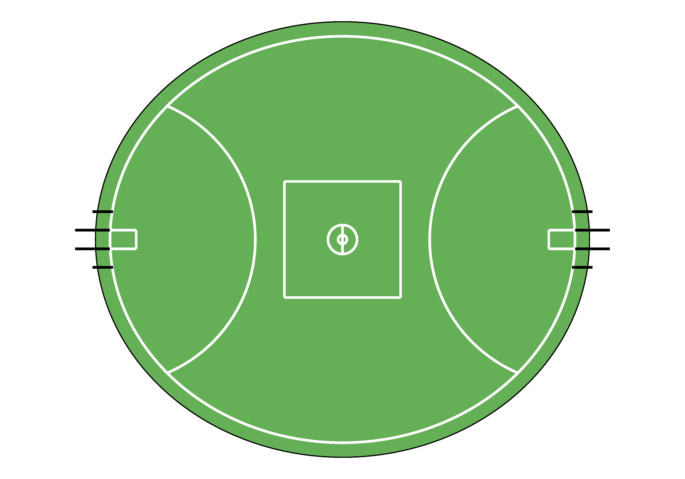

# PlotAFLField
This repository contains a set of functions to plot an AFL field

## Contents
- `plot_afl_field.R`: R script containing the function to plot an AFL field
- `PlotAFLField.Rproj`: R project file for the PlotAFLField project.
- `README.md`: This file providing an overview of the repository.
- `afl_field.png`: Image of the plot that the function generates

## Example Plot
`afl_field(venue_length = 160, venue_width = 140, venue_arclength = 50)` 
