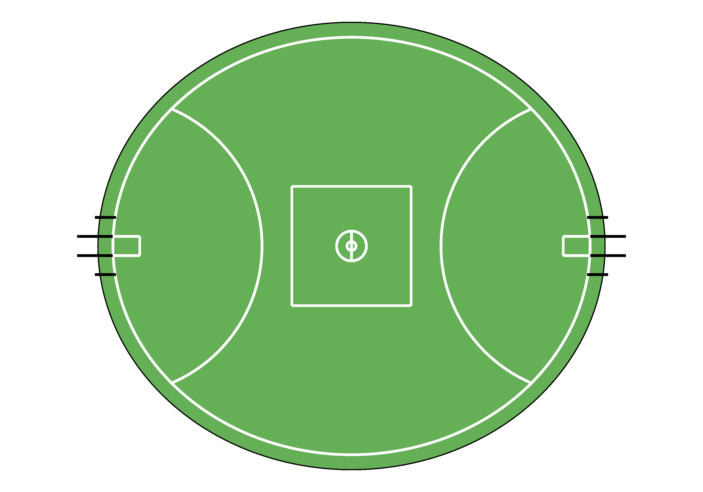
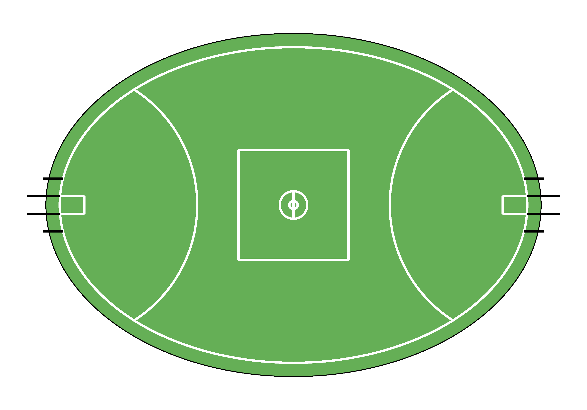

# PlotAFLField
This repository contains a set of functions to plot an AFL field

## Contents
- `plot_afl_field.R`: R script containing the function to plot an AFL field
- `PlotAFLField.Rproj`: R project file for the PlotAFLField project.
- `README.md`: This file providing an overview of the repository.
- `images`: Folder containing images of the plots that the functions generate

## Example Plots
`afl_field(venue_length = 160, venue_width = 140, venue_arclength = 50)` 

`afl_field(venue_length = 170, venue_width = 116, venue_arclength = 50)` 

`afl_field(venue_length = 155, venue_width = 136, venue_arclength = 50)` 
